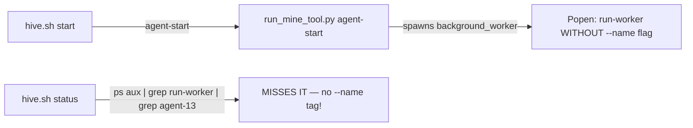

# AWP Agents Project — Pre-Push Diagnostic & Fix Plan

> **Date**: 2026-04-26  
> **Upstream Status**: All three upstream repos (`awp-skill`, `mine-skill`, `prediction-skill`) are at latest.

---

## Part 1: Diagnostic Results

### 🔴 CRITICAL — Must Fix Before Push

#### C1. **Leaked API Keys in Tracked Scripts**
| File | Secret |
|---|---|
| [create_batch_agents.py](file:///home/losbanditos/_code/awp-agents-project/scripts/create_batch_agents.py#L29) | OpenRouter API key `sk-or-v1-5f78...` hardcoded on line 29 |
| [config/.env](file:///home/losbanditos/_code/awp-agents-project/config/.env#L7) | Google AI key `AIzaSy...` — **already gitignored** (safe), but still worth noting |

> [!CAUTION]
> `create_batch_agents.py` is **git-tracked** and contains a live API key. Pushing this to GitHub **exposes your key publicly**. The key must be removed and the git history scrubbed (or the key rotated).

#### C2. **~6,950 Junk Files Tracked in Git** (`src/python/output/`)
```
Total tracked files: 7,271
Files under src/python/output/: 6,946  (95.5% of the entire repo!)
```
These are runtime crawl artifacts (JSON results, task inputs). They contain no source code and massively bloat the repo. They were accidentally committed because `output/` is not in `.gitignore` at the right scope.

#### C3. **Scratch Scripts Tracked with Potential Sensitive Data**
Files in `scratch/` directory (`check_doctor.py`, `reconfigure_fleet.py`, `remove_wikipedia.py`) are tracked. These are throwaway debugging scripts that shouldn't be in the repo.

---

### 🟠 HIGH — Breaks Functionality

#### H1. **Hardcoded Absolute Paths (Breaks Portability)**
The project will **not work** if cloned by anyone else or to a different path.

| File | Line | Hardcoded Path |
|---|---|---|
| [hive.sh](file:///home/losbanditos/_code/awp-agents-project/scripts/hive.sh#L16) | 16 | `export PATH="/home/losbanditos/.local/bin:$PATH"` |
| [agent_wrapper.sh](file:///home/losbanditos/_code/awp-agents-project/src/python/prediction_tracker/agent_wrapper.sh#L17) | 17-18 | Hardcoded `.venv/bin/activate` path |
| [agent_wrapper.sh](file:///home/losbanditos/_code/awp-agents-project/src/python/prediction_tracker/agent_wrapper.sh#L26) | 26 | Hardcoded `hint_generator.py` path |
| [scale_up_50.py](file:///home/losbanditos/_code/awp-agents-project/scripts/scale_up_50.py#L8) | 8, 51 | Hardcoded `PROJECT_ROOT` and `BIN_PATH` |

#### H2. **Miner Lifecycle Mismatch — `hive.sh` Starts `agent-start` but Checks for `run-worker`**

This is the root cause of the **MINE: OFF** status despite miners running:



- `hive.sh` line 97 launches `agent-start`, which internally spawns a `run-worker` subprocess via `background_worker.py`
- `background_worker.py` line 98: `command = [python_bin, "-u", str(script_path), "run-worker", str(interval), "0"]` — **no `--name` flag**
- `hive.sh` line 189 status check: `ps aux | grep "run-worker" | grep "$search_tag"` — looks for agent name, but the spawned process doesn't have it
- **Result**: Status always shows `MINE: OFF` even when miners are running; duplicate miners spawn on restart

#### H3. **Logging Misconfiguration — `stderr` vs `stdout`**

`run_mine_tool.py` configures logging to `sys.stderr`:
```python
# Current (broken):
stream=sys.stderr,
```

But `background_worker.py` line 105 only redirects `stdout` to the log file:
```python
stdout=handle,
stderr=subprocess.STDOUT,  # This redirects stderr → stdout → file
```

Wait — `stderr=subprocess.STDOUT` actually redirects stderr into stdout, which goes to the file handle. So this works **by accident**. However, the upstream version routes to `sys.stdout` explicitly and has a **guard against double-configuration** that the project version lacks. This means if the worker re-execs itself (auto-update), it will double-configure logging.

#### H4. **`output/` and `awp-skill/` Not in `.gitignore`**
- `output/` (project root) — runtime logs and mine output
- `awp-skill/` — upstream submodule/clone, should not be tracked in this project's git
- `src/python/output/` — 6,946 crawl artifact files tracked (see C2)
- `src/rust/prediction-skill_old*/` — stale backup directories

---

### 🟡 MEDIUM — Should Fix

#### M1. **`config/.env.example` Has Wrong Default `PLATFORM_BASE_URL`**
```
.env.example: PLATFORM_BASE_URL="https://api.minework.net"
```
But the agents use different URLs depending on predict vs mine (`api.agentpredict.work` vs `api.minework.net`). The example file only shows one, which is confusing.

#### M2. **`requirements.txt` is Incomplete**
Current `src/python/requirements.txt`:
```
pandas
beautifulsoup4
httpx
python-dotenv
eth-account
```
Missing packages actually used by mine_skill: `lxml`, `websockets`, `pycryptodome` or `eth-abi`, etc. This would cause `ImportError` on fresh install.

#### M3. **Watchdog Starts Without Agent-Specific Credentials**
The watchdog calls `hive.sh start` to restart crashed agents, but `hive.sh start` needs the agent's env loaded. The watchdog passes no interval argument, defaulting to 120s regardless of the randomized interval.

---

## Part 2: Implementation Plan

### Phase 1: Secret Scrubbing & `.gitignore` Hardening
**Priority**: 🔴 CRITICAL — Do first

1. **Remove API key from `create_batch_agents.py`** — replace with `os.environ.get("OPENAI_API_KEY", "")`
2. **Update `.gitignore`** to add:
   ```
   # Runtime output artifacts
   output/
   src/python/output/
   
   # Upstream skill repos (cloned separately)  
   awp-skill/
   
   # Scratch/debug scripts
   scratch/
   
   # Stale backups
   *_old*/
   ```
3. **Remove tracked junk**: `git rm -r --cached src/python/output/ scratch/`

> [!IMPORTANT]
> After removing the key from the file, the key **still exists in git history**. You should either:
> - Use `git filter-branch` or `git-filter-repo` to purge it, OR
> - **Rotate/revoke the API key** (recommended — simpler and more secure)

### Phase 2: Hardcoded Path Elimination
**Priority**: 🟠 HIGH

1. **`hive.sh` line 16**: Replace with `export PATH="$HOME/.local/bin:$PATH"`
2. **`agent_wrapper.sh`**: Derive all paths from `PROJECT_ROOT` using `$(dirname "$0")`
3. **`scale_up_50.py`**: Use `Path(__file__).resolve().parent.parent` pattern (like `create_batch_agents.py` already does)

### Phase 3: Miner Lifecycle Fix
**Priority**: 🟠 HIGH — Core bug

**Option A (Recommended)**: Change `hive.sh` to use `run-worker` directly instead of `agent-start`
```bash
# Instead of:
nohup "$PYTHON_VENV_PYTHON" "$RUN_MINE_TOOL_SCRIPT" agent-start > "$agent_dir/logs/mine.log" 2>&1 &

# Use:
nohup "$PYTHON_VENV_PYTHON" "$RUN_MINE_TOOL_SCRIPT" run-worker 10 0 --name "$name" > "$agent_dir/logs/mine.log" 2>&1 &
```

This ensures:
- The `--name` flag makes the process identifiable by `status_all`
- No double-spawn risk from `agent-start`'s background worker detection
- Direct lifecycle control

**Option B**: Keep `agent-start` but change `status_all` to check for `agent-start` instead of `run-worker`. Less clean.

### Phase 4: Logging Fix
**Priority**: 🟠 HIGH

Replace the `_configure_background_logging()` function in `run_mine_tool.py` with the upstream version that:
- Routes to `sys.stdout` (not `sys.stderr`)
- Guards against double-configuration on re-exec
- Uses a named formatter

### Phase 5: Repository Cleanup
**Priority**: 🟡 MEDIUM

1. Remove tracked stale directories:
   ```bash
   git rm -r --cached src/python/output/
   git rm -r --cached scratch/
   ```
2. Delete stale backup directories from disk:
   ```bash
   rm -rf src/rust/prediction-skill_old/
   rm -rf src/rust/prediction-skill_old_20260421112300/
   ```

### Phase 6: Requirements & Validation
**Priority**: 🟡 MEDIUM

1. Update `src/python/requirements.txt` to include all mine_skill dependencies
2. Cross-reference with `awp-skill/mine-skill/requirements-core.txt`
3. Run a dry-run of the full lifecycle:
   ```bash
   ./scripts/setup.sh
   ./scripts/init_agents.sh  # with test agent
   ./scripts/hive.sh start agent-test
   ./scripts/hive.sh status
   ```

---

## Summary Table

| ID | Severity | Issue | Fix Phase |
|---|---|---|---|
| C1 | 🔴 CRITICAL | API key leaked in tracked script | Phase 1 |
| C2 | 🔴 CRITICAL | ~6,950 junk files tracked | Phase 1 + 5 |
| C3 | 🔴 CRITICAL | Scratch scripts tracked | Phase 1 + 5 |
| H1 | 🟠 HIGH | Hardcoded absolute paths | Phase 2 |
| H2 | 🟠 HIGH | Miner lifecycle mismatch | Phase 3 |
| H3 | 🟠 HIGH | Logging stderr vs stdout | Phase 4 |
| H4 | 🟠 HIGH | Missing gitignore entries | Phase 1 |
| M1 | 🟡 MEDIUM | Confusing .env.example | Phase 6 |
| M2 | 🟡 MEDIUM | Incomplete requirements.txt | Phase 6 |
| M3 | 🟡 MEDIUM | Watchdog restart lacks interval | Phase 6 |
